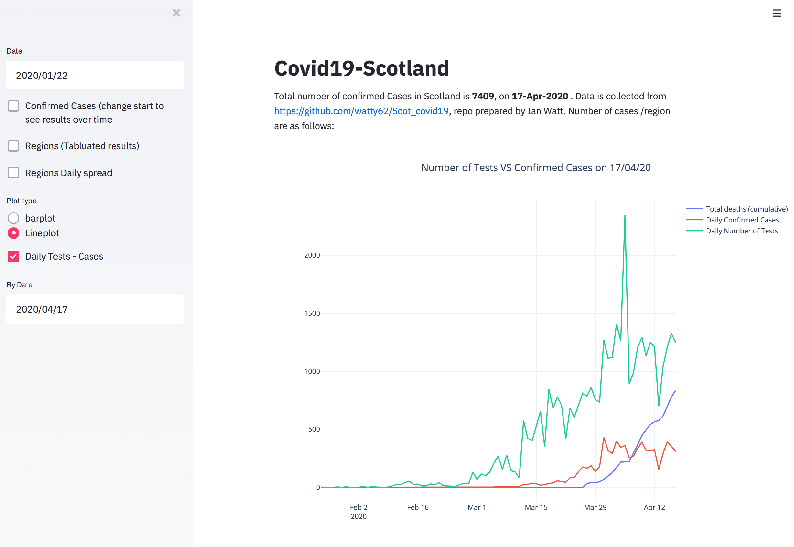
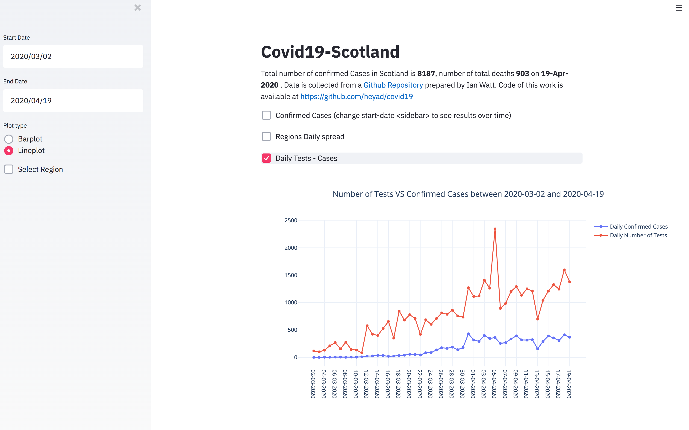

### Streamlit Examples 

This is my first attempt with [Streamlit](https://www.streamlit.io/). It is an open-source framework, free, Python-based and easy to use tool to build and deploy data-driven and machine learning applications. This repo was started in a nice and sunny weekend in Aberdeen, during the lockdown and when #stayAthome was trending on twitter and elsewhere. 

#### Requirements 


* You need to have Python installed on your machine 
* You need to have streamlit installed, if not, simply issue the following command  

```
$pip install streamlit
```

#### Covid19 - Scotland (14th of April)

Here is an example of using streamlit to explore and visualise data. Data Loaded from [this repo](https://github.com/watty62/Scot_covid19). Thanks to Ian Watt for providing this dataset. Easiest way to run it is by using this command from your command line:
```
$ streamlit run https://raw.githubusercontent.com/heyad/covid19/master/covid19_Scotland/Scotland_Covi19.py
```

Alternatively, check the [Code](covid19_Scotland/Scotland_Covi19.py). Download and run the code as follows: 

```
streamlit run ScotlandCovid19.py 
```


If everything is OK,  your browser will open and load the following page: 


Use the left hand sidebar to explore the data further (i.e. number of daily tests carried in Scotland vs number of confirmed cases of Covid19)


You can also view the daily spread across various regions of Scotland within two specific dates. This can be viewed as line/ bar plots 



#### To do  

* Data type checking, exceptions handling, etc...
* Add more functional features / plots 
* More in-depth analysis of the data i.e. time-series, trends, etc...
* Compare data of one country to others 


#### Comments / Questions 

You can reach me at [my staff page](https://www3.rgu.ac.uk/dmstaff/elyan-eyad) or on [linkedin](http://www.linkedin.com/in/elyan )

